# REPO Mods Installer [v1.0.0]
#### 📛 Обращаю внимание, что для корректной работы необходимо выполнить все пункты 📛

## 📥 Установка

### 📁 Находим локальные файлы игры (Steam)

1. Откройте Steam
2. Перейдите в библиотеку
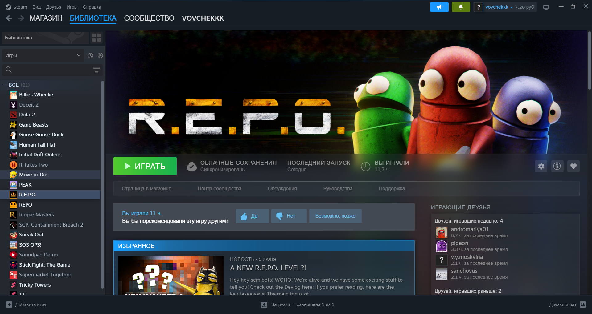
3. Найдите `REPO`
4. Нажмите правой кнопкой мыши по игре
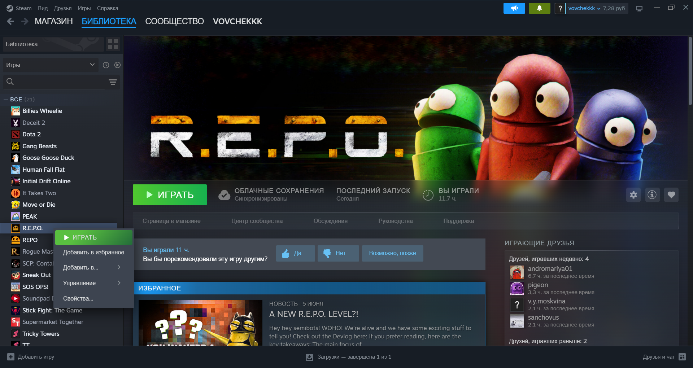
5. Выберите: `Управление` → `Просмотреть локальные файлы`
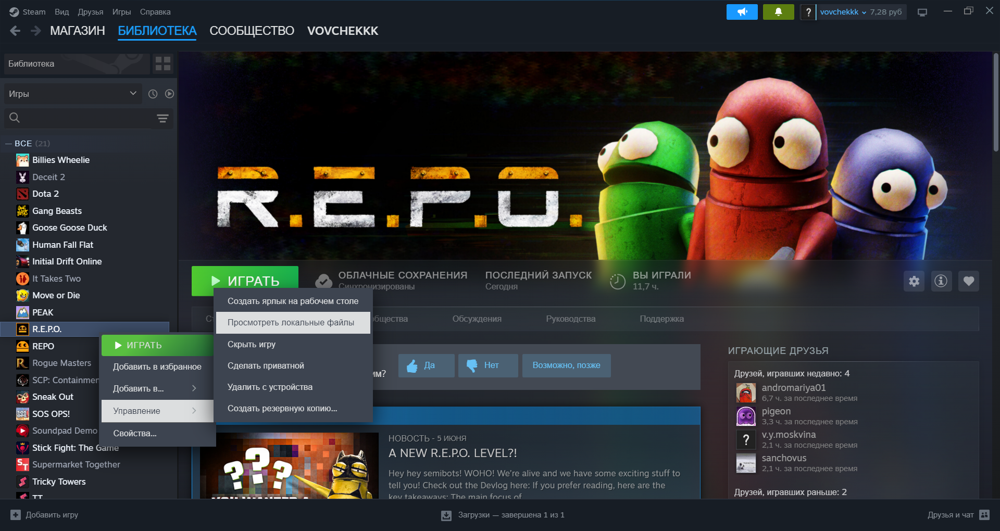
6. Откроется папка игры `REPO`
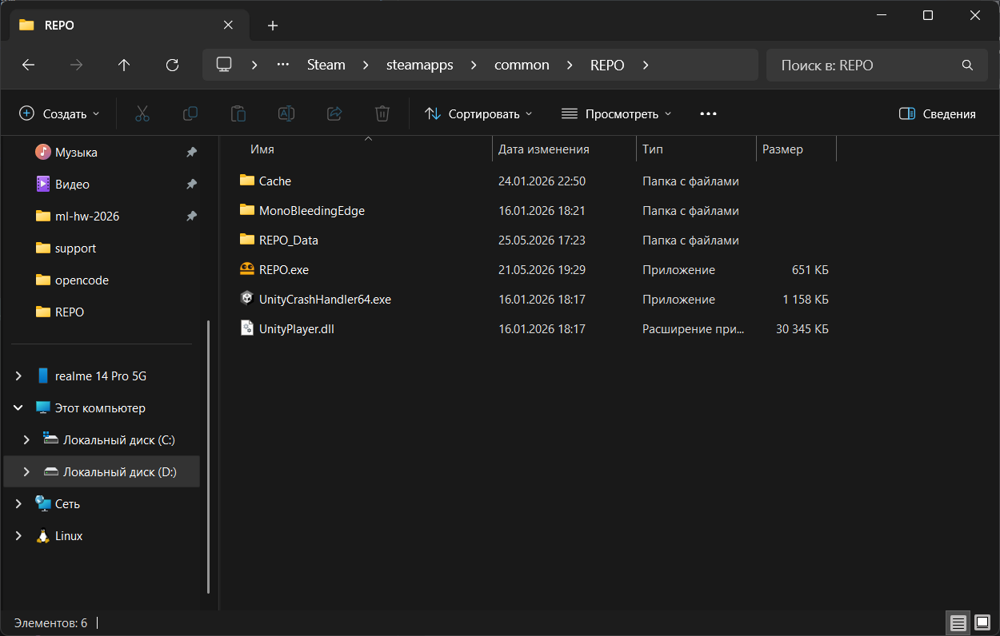

### 💫 Склонируйте репозиторий в папку `REPO`:

1. Нажмите правой кнопкой мыши на пустое пространство папки
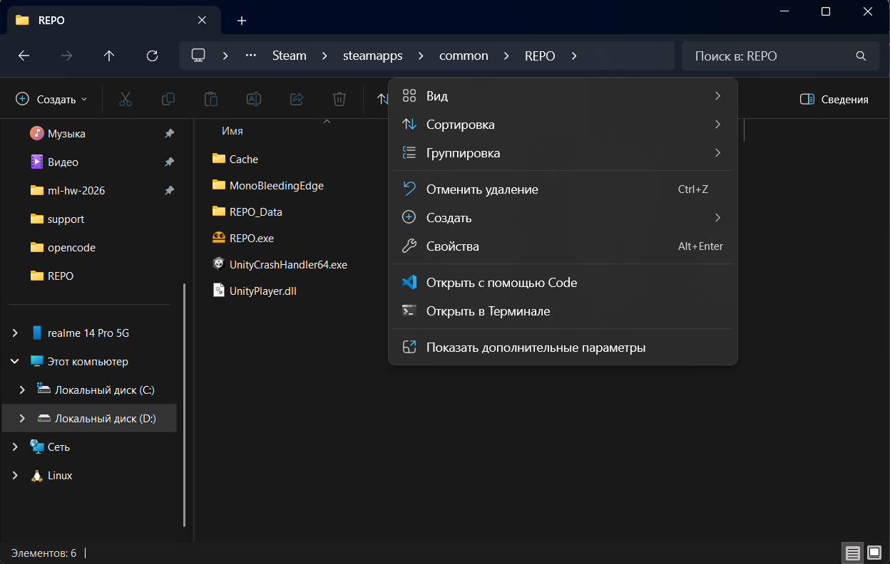
2. Нажмите `Показать дополнительные параметры`
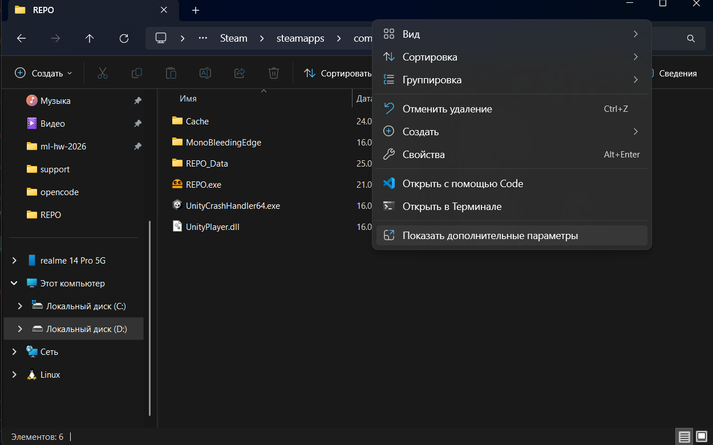
3. Нажмите `Open Git Bash here`
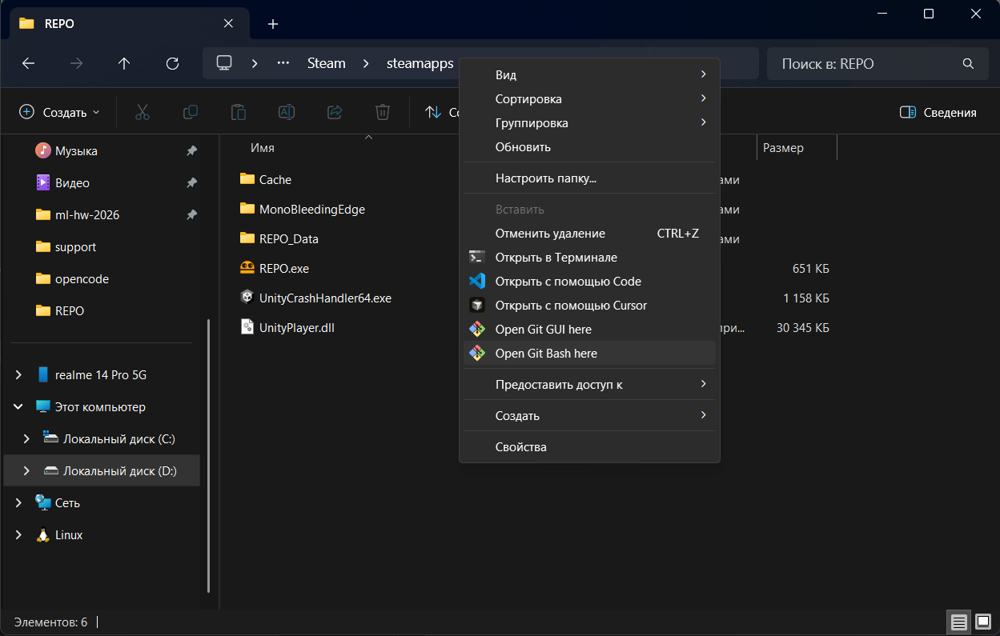
4. Введите команду
```bash
git clone https://github.com/vovchekkk/repo-mods.git
```
5. Дождитесь, пока клонирование полностью завершиться, не торопитесь
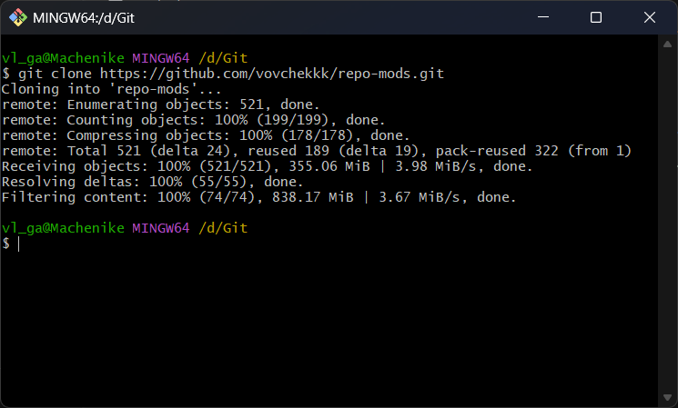

### 🤔 После клонирования репозитория структура должна выглядеть так:

```
REPO/
├── какие-то папки игры
├── ✅ repo-mods/
├── REPO.exe
├── UnityCrashHandler64.exe
└── UnityPlayer.dll
```

## 🔄 Первое добавление/Обновление модов

1. Перейдите в папку `repo-mods`
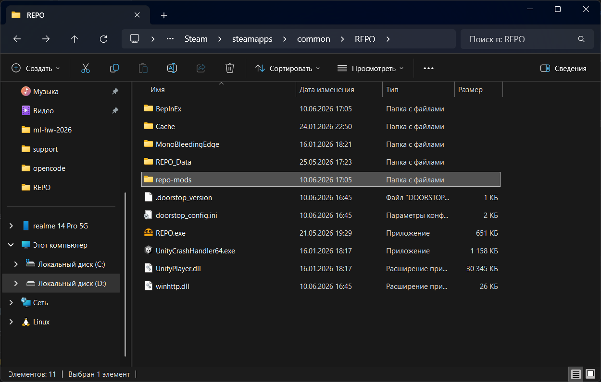

2. Для первого добавления/обновления конфигурации модов используйте скрипт `update.bat`
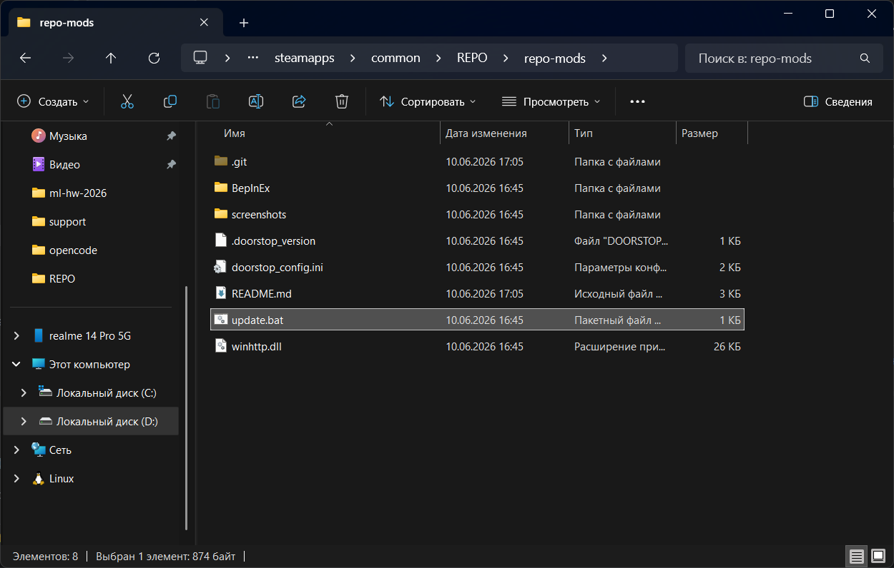

3. Дождитесь, пока первое добавление/обновление полностью завершиться, не торопитесь
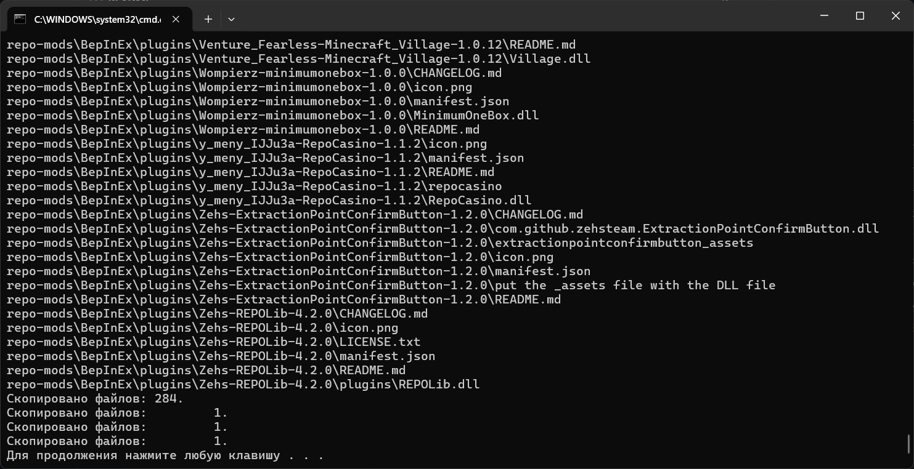

### ⚙️ Что делает скрипт

Скрипт автоматически:

```
Синхронизирует репозитории:
git fetch origin
git checkout main
git reset --hard origin/main
git clean -fd

Переходит в корень игры

Удаляет старые моды:
BepInEx/plugins

Копирует файлы в игру:
BepInEx/
BepInEx/plugins
.doorstop_version
doorstop_config.ini
winhttp.dll
```

### 🤔 После добавления модов структура должна выглядеть так:

```
REPO/
├── ✅ BepInEx/
├── какие-то папки игры
├── ✅ repo-mods/
├── ✅ .doorstop_version
├── ✅ doorstop_config.ini
├── REPO.exe
├── UnityCrashHandler64.exe
├── UnityPlayer.dll
└── ✅ winhttp.dll
```

👉 В итоге игра всегда запускается с актуальными модами без ручных действий.

## 🧰 Создание ярлыка для удобного обновления модов

### ⚓ В папке `repo-mods` создаем ярлык для скрипта `update.bat`

1. Нажмите на скрипт `update.bat` правой кнопкой мыши
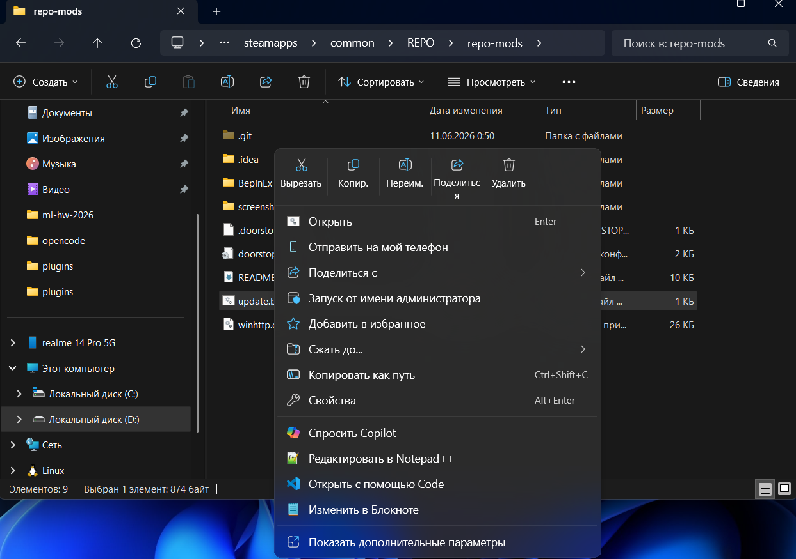
2. Нажмите `Показать дополнительные параметры`
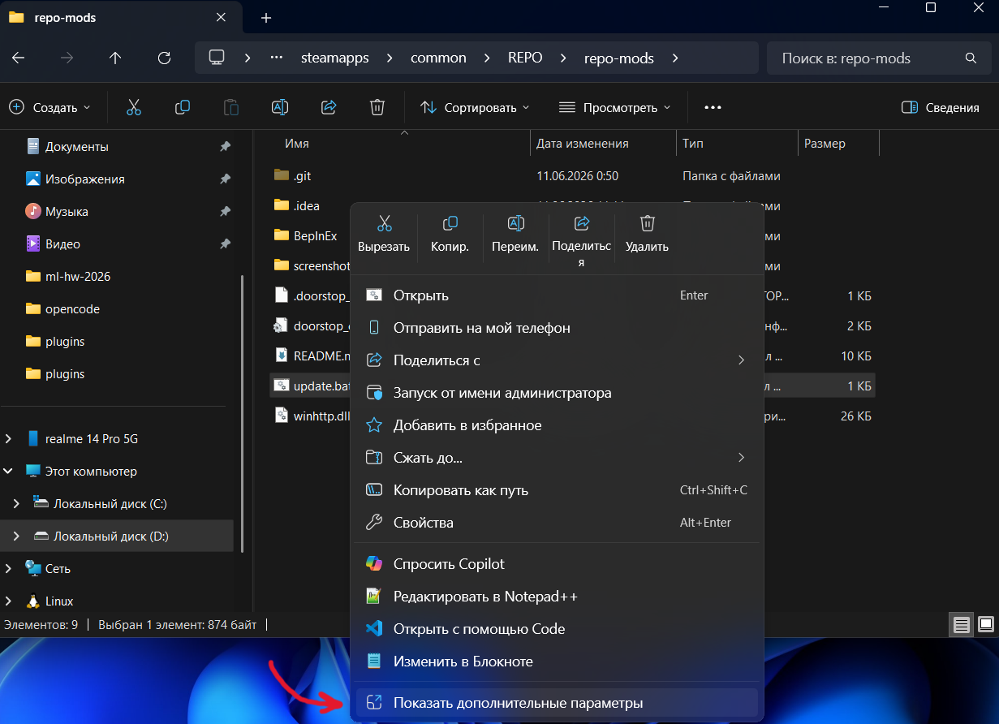
3. Нажмите `Cозд. ярлык`
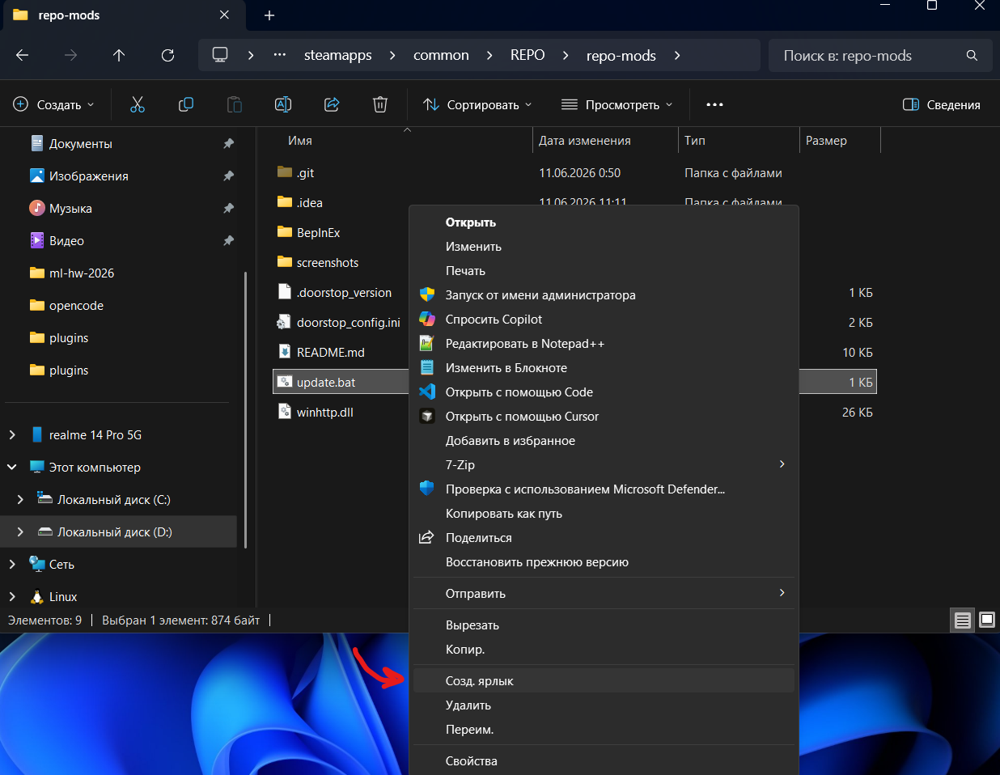
4. Ярлык создан
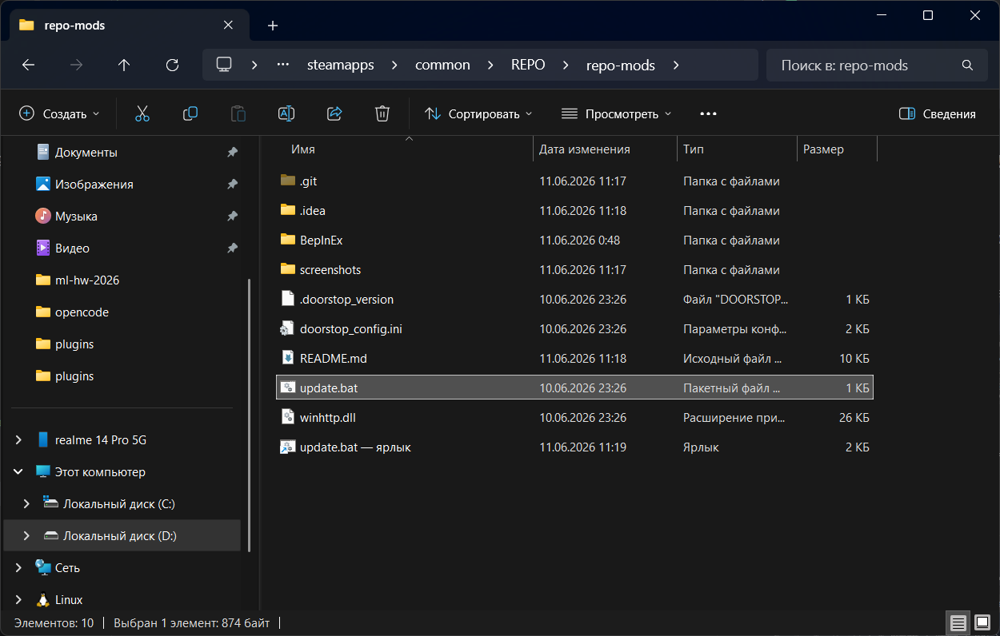

### 📢 Переименование и перемещение

1. Можете переименовать его так, как вам удобно
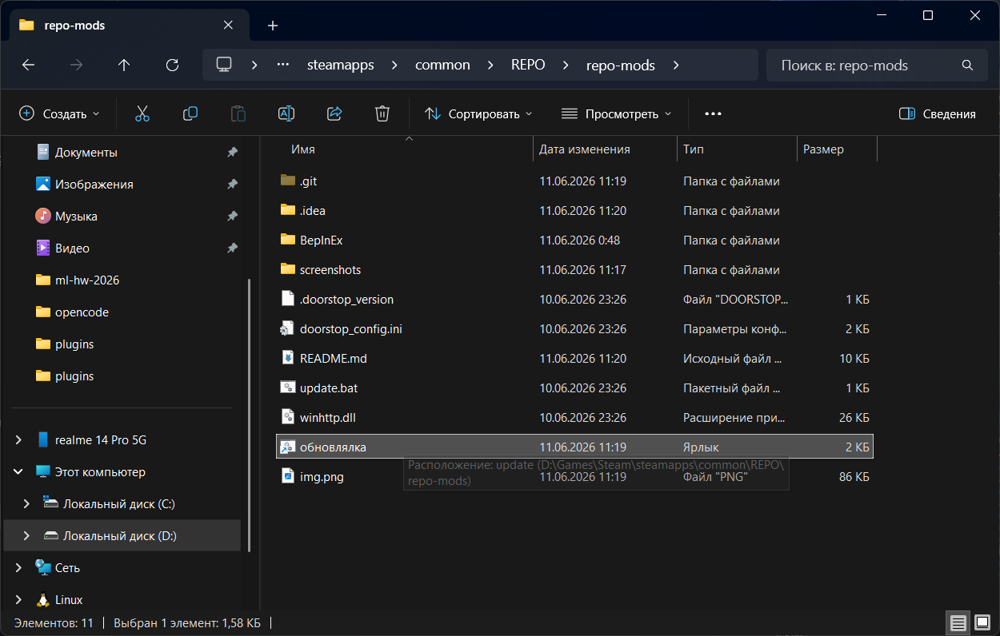
2. Можете переместить его туда, куда вам удобно
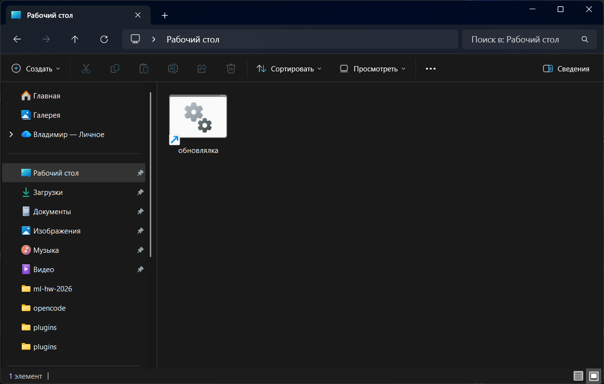

👉 Теперь ради обновления модов не придется заходить в корневую папку игры `REPO`

## 📦 Моды [Последнее обновление: 11.06.26 - 00:51]
#### 👉 Все моды берутся [отсюда](https://thunderstore.io/c/repo/?ordering=most-downloaded&section=mods), так что можете предлагать понравившиеся 👈

### 1. [MenuLib](https://thunderstore.io/c/repo/p/nickklmao/MenuLib/) [v2.5.4]
A library for creating UI!

### 2. [REPOConfig](https://thunderstore.io/c/repo/p/nickklmao/REPOConfig/) [v1.2.6]
Edit mod configs in-game!

### 3. [REPOLib](https://thunderstore.io/c/repo/p/Zehs/REPOLib/) [v4.2.0]
Library for adding content to R.E.P.O.

### 4. [TextUpgradesUIScale](https://thunderstore.io/c/repo/p/DarkSpider/TextUpgradesUIScale/) [v1.2.1]
Scales the R.E.P.O. upgrade list UI after v0.4.0 with a simple configurable step-based text scaler.

### 5. [KeybindLib](https://thunderstore.io/c/repo/p/BULLETBOT/KeybindLib/) [v1.0.6]
A library that lets you add your own keybinds to the controls.

### 6. [NoItemSpawnLimit](https://thunderstore.io/c/repo/p/HeroHanex/NoItemSpawnLimit/) [v1.0.8]
Removes or customizes truck item spawn limits for all items, including modded items. Host-only mod compatible with multiplayer.

### 7. [AutoHookGenPatcher](https://thunderstore.io/c/repo/p/Hamunii/AutoHookGenPatcher/) [1.1.1]
Automatically generates MonoMod.RuntimeDetour.HookGen's MMHOOK files during the BepInEx preloader phase.

### 8. [No Save Delete](https://thunderstore.io/c/repo/p/PxntxrezStudio/No_Save_Delete/) [v1.3.2]
This mod for R.E.P.O. prevents save files from being deleted upon player death, allowing you to continue playing without losing progress. Features in-game save manager (F7), quick reload (F9), and unlimited save slots!

### 9. [minimumonebox](https://thunderstore.io/c/repo/p/Wompierz/minimumonebox/) [v1.0.0]
Guarantees at least one cosmetic box spawn per level, leaves vanilla quality rolls untouched.

### 10. [MoreTaxTokensSimple](https://thunderstore.io/c/repo/p/cn_xc/MoreTaxTokensSimple/) [v1.7.1]
已支持至 REPO v0.4.4 版本，交流QQ群573485890，提取外观箱子时获得更多税款代币。默认 10 倍。

### 11. [MoreUpgrades](https://thunderstore.io/c/repo/p/BULLETBOT/MoreUpgrades/) [v1.7.3]
Adds more unique upgrade items and is highly configurable.

### 12. [ExtractionPointConfirmButton](https://thunderstore.io/c/repo/p/Zehs/ExtractionPointConfirmButton/) [1.2.0]
Adds a confirm button to extraction points.

### 13. [MinecraftStrongholdLevel](https://thunderstore.io/c/repo/p/AriIcedT/MinecraftStrongholdLevel/) [1.14.0]
minecraft stronghold map with custom features.

### 14. [ChatBox](https://thunderstore.io/c/repo/p/UnloadedHangar/ChatBox/) [v1.3.0]
Adds chat box to REPO for easier communication. Configurable!

### 15. [MoreShopItems Updated](https://thunderstore.io/c/repo/p/Jettcodey/MoreShopItems_Updated/) [v4.2.2]
MoreShopItems Updated!!! The Store now carries more items on the shelves!

### 16. [FNAFLevel](https://thunderstore.io/c/repo/p/OrtonLongGaming/FNAFLevel/) [v1.1.1]
Freddy Fazbear's Pizza, where Fantasy meets Fun! - NOW UPDATED for Monster Update!

### 17. [Tolian Levels](https://thunderstore.io/c/repo/p/Tolian/Tolian_Levels/) [v0.3.6]
adds new levels a game. by tolian!

### 18. [Wesleys Levels](https://thunderstore.io/c/repo/p/Magic_Wesley/Wesleys_Levels/) [1.1.11]
Adds a new level

### 19. [Deeproot Garden](https://thunderstore.io/c/repo/p/Beaniebe/Deeproot_Garden/) [v1.1.8]
A Vanilla themed garden level! (MONSTER UPDATE)

### 20. [REPOGambling](https://thunderstore.io/c/repo/p/DirtyGames/REPOGambling/) [v1.7.1]
REPO Gambling adds configurable casino to the shop! A wheel with many prizes, death, upgrade, mystery, jackpot and more! Slot machines with jackpots and bets! Configurable settings to ensure you play the way you want too.

### 21. [MapVote](https://thunderstore.io/c/repo/p/Patrick/MapVote/) [v1.1.2]
Allows you and your friends to vote for the next map to play!

### 22. [Minecraft Village](https://thunderstore.io/c/repo/p/Venture_Fearless/Minecraft_Village/) [v1.0.12]
A map that adds a Minecraft village in a dark valley, with underground caves filled with redstone puzzles hiding loot within.

### 23. [NoGunSpread](https://thunderstore.io/c/repo/p/Lazarus/NoGunSpread/) [v1.0.4]
Removes the inaccurate bullet spread from all guns!

### 24. [Melanie REPO Levels MelanieMelicious](https://thunderstore.io/c/repo/p/MelanieMelicious/Melanie_REPO_Levels_MelanieMelicious/) [v0.2.0]
Currently adds 1 level based on one of my Lethal Company interiors. More tile variety, decor, and levels to be added in future updates. Ideas, and suggestions appreciated. You can find me on the R.E.P.O modding Discord.

### 25. [Dead Map Access](https://thunderstore.io/c/repo/p/SaturnKai/Dead_Map_Access/) [v1.0.4]
Allows dead players to open the map while spectating.

### 26. [UnlimitedOrbs](https://thunderstore.io/c/repo/p/TheRavenNest/UnlimitedOrbs/) [v1.0.3]
Removes the Monster Orb cap from 3 to the maximum int value, which removes the softlock the game has if you accidently destroy all the loot

### 27. [CANNON](https://thunderstore.io/c/repo/p/Sai/CANNON/) [v0.8.6]
Adds a fully functional and high power cannon to REPO

### 27. [ChatClipboard](https://thunderstore.io/c/repo/p/ManancialGD/ChatClipboard/) [v1.0.0]
copy and paste chat messages.

### 29. [BigNuke](https://thunderstore.io/c/repo/p/TitanVortex/BigNuke/) [v1.0.1]
Big Nuke with big explosion!

### 30. [BigNuke Fix](https://thunderstore.io/c/repo/p/Omniscye/BigNuke_Fix/) [v1.0.0]
Compatibility fix that updates BigNuke to work with the current version of REPO.

### 31. [ML Moreplayers](https://thunderstore.io/c/repo/p/Malina/ML_Moreplayers/) [v1.0.3]
Allows changing the max player count in R.E.P.O.

### 32. [Fart Grenade](https://thunderstore.io/c/repo/p/Eteli/Fart_Grenade/) [v1.0.0]
Changes the grenade explosion sound to be a fart

### 33. [RepoCasino](https://thunderstore.io/c/repo/p/y_meny_IJJu3a/RepoCasino/) [v1.1.2]
casino for repo

### 34. [SkyCustomLevelSizes Skydorm](https://thunderstore.io/c/repo/p/Skydorm/SkyCustomLevelSizes_Skydorm/v/0.0.1/) [v0.0.1]
Script to allow bigger Modules instead of 3x3

### 35. [NoDamageInShop](https://thunderstore.io/c/repo/p/Snowlance/NoDamageInShop/) [v1.0.1]
Take no damage in the shop

### 36. [BluePrince](https://thunderstore.io/c/repo/p/Arc059/BluePrince/) [v1.3.2]
Adds Mt Holly Level

### 37. [Burpleson Base Level](https://thunderstore.io/c/repo/p/compraventa_de_facebook/Burpleson_Base_Level/) [v3.5.0]
Military themed level with a mix of Goldeneye, Half-Life, Halo and much more!

### 38. [TheFacility](https://thunderstore.io/c/repo/p/grey5525/TheFacility/) [v1.1.3]
Adds a new Level and custom Valuables!

### 39. [AhhhDeath](https://thunderstore.io/c/repo/p/Pudack/AhhhDeath/) [v1.0.1]
Replaces the default death explosion with the ahhh echo meme.

### 40. [Peachs Castle Level Mod](https://thunderstore.io/c/repo/p/Skydorm/Peachs_Castle_Level_Mod/) [v0.3.5]
Adds a new level to Repo, Peach Castle, with new Gimmicks for the Level.

### 41. [DisableClientsideTimeout](https://thunderstore.io/c/repo/p/JustSomeGuy/DisableClientsideTimeout/) [v1.1.0]
Disables the client-side Photon TimeoutDisconnect check to potentially reduce random disconnects. Now includes a configuration option to toggle the patch. Does not prevent server-side timeouts.

### 42. [DampMine](https://thunderstore.io/c/repo/p/DragonClawStudios/DampMine/) [v0.0.17]
Adds a damp mine level.

### 43. [LateRepo](https://thunderstore.io/c/repo/p/Chaosholz/LateRepo/) [v1.6.4]
Adds LateJoin to R.E.P.O. and includes several quality-of-life features.

### 44. [RepoAdminMenu](https://thunderstore.io/c/repo/p/proferabg/RepoAdminMenu/) [v1.0.16]
The best admin menu for R.E.P.O.

### 45. [ShowEnemyHealth](https://thunderstore.io/c/repo/p/Rozza/ShowEnemyHealth/) [v1.0.3]
Adds health & damage UI indicators for enemies.

### 46. [RoboUnion](https://thunderstore.io/c/repo/p/linkoid/RoboUnion/) [v0.6.2]
[MorePlayers] The Robo Union empowers YOU 🫵 to safely increase (or decrease) the maximum number of workers on a R.E.P.O. team. Leave no Semibot behind!

### 47. [FreecamSpectate](https://thunderstore.io/c/repo/p/nickklmao/FreecamSpectate/) [v1.1.0]
Allows you to fly around while spectating.